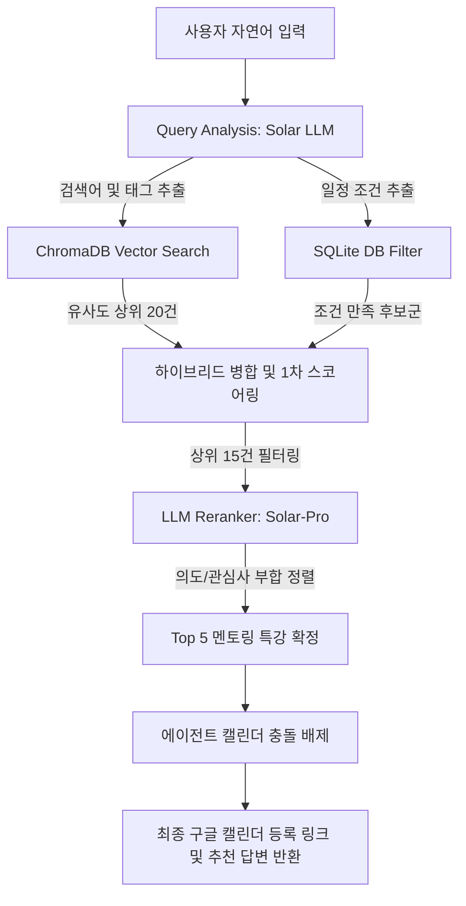

# 소마 메이트 데이터베이스 & RAG 시스템 아키텍처 사양서 (Spec)

본 문서는 소마 메이트(SoMa Mate) 서비스의 데이터 영속화(SQLite), 의미론적 의미 검색 RAG(ChromaDB), 그리고 지능형 대화 기억(Persistent Chat Memory) 및 프롬프트 엔지니어링(Chain of Thought & Reranking)의 구현 스펙을 명세합니다.

---

## 1. 관계형 데이터베이스 스펙 (SQLite)

- **파일 경로**: `backend/data/soma.db`
- **목적**: 멘토링/특강 원시 데이터, 연수생 개인 시간표, 소속 팀 정보 및 대화 이력의 영구 저장 및 ACID 트랜잭션 보장.

### 1) 테이블 스키마

#### A. 멘토링 및 특강 (`mentorings`)
| 컬럼명 | 데이터 타입 | 설명 |
|--------|------------|------|
| `id` | `TEXT (PRIMARY KEY)` | 특강/멘토링 고유 식별 일련번호 |
| `type` | `TEXT` | 콘텐츠 분류 (`mentoring` 또는 `lecture`) |
| `title` | `TEXT` | 모집/특강 제목 |
| `author` | `TEXT` | 작성 멘토명 |
| `dateStr` | `TEXT` | 강의 날짜 (YYYY-MM-DD 포맷) |
| `timeRangeStr` | `TEXT` | 강의 시간대 (HH:MM ~ HH:MM) |
| `status` | `TEXT` | 접수 상태 (`접수중`, `마감` 등) |
| `location` | `TEXT` | 진행 장소 (서울 본원 아남타워, 온라인 등) |
| `deliveryMethod`| `TEXT` | 진행 방식 (온/오프라인) |
| `isOnline` | `INTEGER` | 온라인 여부 플래그 (0: 오프라인, 1: 온라인) |
| `raw_json` | `TEXT` | 프론트엔드가 수집하여 보낸 JSON 객체 전문 |

#### B. 개인 시간표 (`user_calendar`)
| 컬럼명 | 데이터 타입 | 설명 |
|--------|------------|------|
| `id` | `TEXT (PRIMARY KEY)` | 신청 내역 고유 ID |
| `title` | `TEXT` | 신청한 특강/멘토링 제목 |
| `url` | `TEXT` | 상세 내역 바로가기 링크 |
| `author` | `TEXT` | 담당 멘토명 |
| `dateStr` | `TEXT` | 일정 일자 |
| `timeRangeStr` | `TEXT` | 일정 시간대 |
| `status` | `TEXT` | 접수 상태 (`출석완료`, `승인`, `취소` 등) |
| `isApproved` | `INTEGER` | 개설/신청 승인 완료 플래그 |
| `raw_json` | `TEXT` | 시간표 JSON 전문 |

#### C. 소속 팀 정보 (`team_info`)
| 컬럼명 | 데이터 타입 | 설명 |
|--------|------------|------|
| `teamName` | `TEXT (PRIMARY KEY)` | 소속 팀명 |
| `leader` | `TEXT` | 팀장 연수생 이름 |
| `members` | `TEXT` | 쉼표(,)로 연결된 팀원 이름 목록 |
| `mentorName` | `TEXT` | 매칭된 전담 멘토 이름 |
| `projectName` | `TEXT` | 프로젝트명 |
| `ictCategoryLarge`| `TEXT` | ICT 대분류 |
| `ictCategoryMedium`| `TEXT`| ICT 중분류 |
| `raw_json` | `TEXT` | 팀 매칭 정보 JSON 전문 |

#### D. 대화 기록 (`chat_messages`)
| 컬럼명 | 데이터 타입 | 설명 |
|--------|------------|------|
| `id` | `INTEGER (PRIMARY KEY AUTOINCREMENT)` | 레코드 식별 아이디 |
| `session_id` | `TEXT` | 대화 세션 식별 고유키 |
| `role` | `TEXT` | 메시지 전송자 역할 (`user`, `assistant`, `tool`) |
| `content` | `TEXT` | 텍스트 본문 |
| `tool_calls` | `TEXT (JSON)` | AIMessage 내의 툴 호출 명세 전문 |
| `tool_call_id` | `TEXT` | ToolMessage에 맵핑된 툴 호출 식별키 |
| `timestamp` | `DATETIME` | 메시지 기록 일시 (기본값 CURRENT_TIMESTAMP) |

---

## 2. 의미 검색 벡터 데이터베이스 스펙 (ChromaDB)

- **보관 경로**: `backend/chroma_data`
- **임베딩 모델**: Upstage `solar-embedding-1-large`
- **컬렉션명**: `mentorings`

### 1) 임베딩 텍스트 설계
텍스트 벡터화 성능을 높이기 위해 아래의 정교한 템플릿 형태로 가공한 뒤 업서트(Upsert)를 수행합니다.

```text
분류: [mentoring / lecture]
제목: [title]
작성자/멘토: [author]
일정: [dateStr] [timeRangeStr]
장소: [location]
진행방식: [deliveryMethod]
상태: [status]
상세 설명: [description]
```

### 2) 메타데이터 필드
ChromaDB 내에서 거리 계산 외의 인덱스 검색/필터링을 위해 다음 메타데이터를 바인딩합니다.
- `id`: 멘토링 고유 키
- `type`: `mentoring` 또는 `lecture`
- `status`: `접수중` 또는 `마감`
- `isOnline`: 온/오프라인 플래그
- `mentor`: 멘토 이름
- `title`: 제목

---

## 3. RAG & 프롬프트 엔지니어링 파이프라인



### 1) Query Analysis
사용자가 *"React 특강 추천해줘"* 라고 하면, `solar-pro` LLM이 이를 분석하여 다음과 같이 정규화합니다.
- `search_query`: `"React 프론트엔드 특강"`
- `content_type`: `"lecture"`
- `keywords`: `["React"]`

### 2) 하이브리드 검색 및 1차 스코어링
- 벡터 거리(Distance) 기준 유사도에 가중치를 부여하고, 수동 스택/도메인 매칭 여부에 따라 가산점을 더하여 1차 병합 후보군을 선정합니다.

### 3) LLM Reranker
- 1차 필터링된 상위 15개 후보군 텍스트를 LLM에 전달하여 사용자의 맥락에 맞는 중요도 기준 순위로 순수 JSON ID 리스트(`["123", "456", "789"]`) 형태로 최종 재정렬합니다.

### 4) 체인 오브 쏘트 (Chain of Thought) 스케줄 매칭
`agent.py`에 적용된 `SYSTEM_PROMPT` 지침에 따라, 에이전트는 추천된 특강 시간표와 사용자의 SQLite 캘린더를 요일/시간별로 대조한 후, 겹치지 않는 일정만 최종 추천하며 충돌 시에는 대안 스케줄을 역제안합니다.
