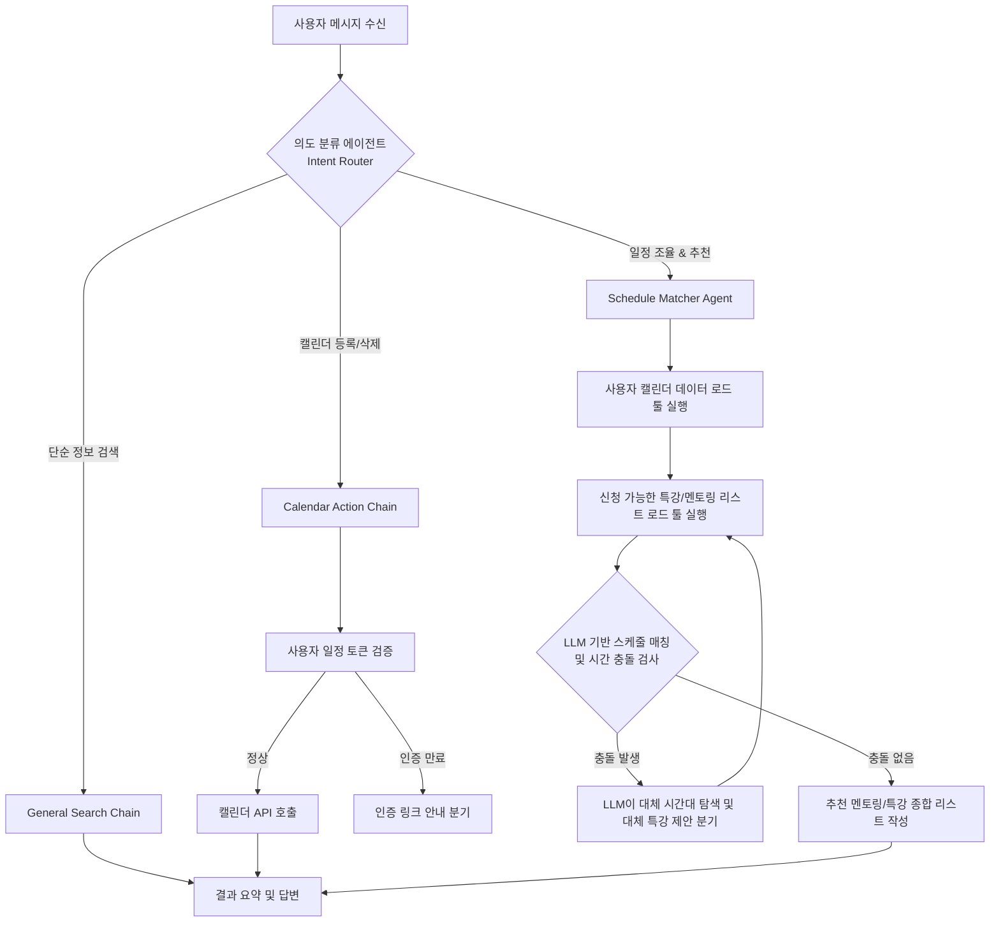

# 소마 메이트 + 소마 캘린더 스마트 에이전트 기획안

본 문서는 소마 연수생 정보 비서인 **소마 메이트 (SoMa Mate)**와 일정 시간표 도구인 **소마 캘린더 (Soma Calendar)**를 결합하여, **LangChain 기반의 고도화된 Agentic Workflow(LLM 분기 처리)**를 적용한 스마트 비서 서비스를 기획하고 구현하는 방안을 담고 있습니다.

---

## 1. 융합 서비스 아이디어: "스마트 시간표 코디네이터"

단순히 데이터베이스에서 멘토링 목록을 조회하는 것을 넘어, **사용자의 현재 개인 일정(시간표)**과 **관심 도메인/스택**, 그리고 **팀 매칭 현황**을 다차원으로 교차 참조하여 지능적인 결정을 내리는 서비스를 제안합니다.

### 🌟 핵심 기능 시나리오

1. **캘린더 맥락을 인지하는 멘토링/특강 자동 조율 (Auto-Scheduler)**
   * **상황**: 사용자가 *"클라우드 분야의 접수 중인 특강을 찾아서 내 시간표와 겹치지 않는 것만 알려줘"*라고 요청합니다.
   * **에이전트 판단**: 사용자의 현재 크롬 캘린더에 등록된 일정 정보(시간대)를 불러와, 신청 가능한 특강들의 일정과 대조합니다. 시간이 겹치는 특강은 제외하고, 비어 있는 꿀 시간대에 들어갈 수 있는 최적의 특강만 선별하여 제안합니다.
   
2. **대화형 스마트 캘린더 제어 (Conversational Calendar Action)**
   * **상황**: 사용자가 *"추천해 준 Spring Boot 멘토링 내 구글 캘린더에 바로 등록해줘"*라고 지시합니다.
   * **에이전트 판단**: 단순히 링크를 안내하는 규칙 기반 동작에서 벗어나, 에이전트가 `add_to_google_calendar` 툴을 스스로 실행하여 사용자의 구글 계정에 일정을 API로 직접 삽입해 줍니다.

3. **팀 빌딩 및 최초 미팅 조율 비서 (Meeting Matcher)**
   * **상황**: *"팀원이 없는 백엔드 개발자를 찾고, 우리 둘 다 이번 주 목요일 오후에 만날 수 있는 비어 있는 시간대도 뽑아줘"*라고 요청합니다.
   * **에이전트 판단**: `search_trainees`로 조건에 맞는 연수생을 찾은 뒤, 해당 연수생의 시간표 정보와 사용자의 시간표 정보를 동시 조회하여 **공통의 가용 시간대(Common Free Slots)**를 LLM이 추론/비교하여 미팅 시간까지 한 번에 예약 제안합니다.

---

## 2. LLM 기반 분기 처리 중심의 Agent Workflow 설계

본 프로젝트의 핵심 목표인 **"LLM 기반의 풍부한 분기 처리"**를 달성하기 위해 설계된 워크플로우입니다. 단순 Tool Calling 루프가 아니라 의사결정 분기, 에러 수정 피드백 루프(Self-Correction)를 내포합니다.



### 🧠 주요 LLM 분기 처리 영역
1. **의도 분류 분기 (Intent Routing)**: 질문을 분석하여 `단순 검색`, `스케줄 충돌 검사`, `외부 API 액션` 등의 경로로 흐름을 분기합니다.
2. **시간 충돌 극복 분기 (Self-Correction & Replanning)**: 사용자가 원하는 특강이 기존 스케줄과 충돌하는 경우, 에이전트가 스스로 판단하여 다른 멘토링을 재검색하거나 비어 있는 다른 날짜를 역제안하는 재생성 루프를 돕니다.
3. **사용자 컨텍스트 보정 분기 (Context Refinement)**: 사용자의 관심 스택이나 목표가 챗봇 메모리에 기록되어 있지 않은 경우, 추천을 바로 중단하고 *"어떤 개발 분야(백엔드/프론트엔드 등)를 지망하시나요?"* 하고 사용자에게 역질문하여 맥락 정보를 수집하는 대화 흐름 분기 처리를 구현합니다.

---

## 3. LangChain 기반 에이전트 아키텍처

기존의 순수 OpenAI SDK 루프에서 **LangChain**으로의 마이그레이션 구조입니다.

### 🛠️ 도입 기술 스택
*   **LangChain Core / Community**: LLM과 도구 선언 및 호출 체인(LCEL) 오케스트레이션.
*   **LangGraph (선택/권장)**: 순환 루프(Self-Correction) 및 복잡한 의사결정 트리(State Graph)를 명확한 상태 전이로 구현하기 위해 도입.
*   **Structured Tools**: 입력 인자를 Pydantic 스키마로 강제하여 안전한 파라미터 전달 보장.
*   **LangChain Memory (Window/Summary Memory)**: 대화가 길어질 때 토큰을 효율적으로 압축 관리.

### 💻 예상 코드 구조 변화

*   **Pydantic 기반 Structured Tool 정의**:
    ```python
    from langchain_core.tools import tool
    from pydantic import BaseModel, Field

    class MentorSearchInput(BaseModel):
        stacks: list[str] = Field(description="기술 스택 목록. 예: ['Spring', 'React']")
        goals: list[str] = Field(description="목표 목록. '취업' 또는 '창업'")

    @tool(args_schema=MentorSearchInput)
    def search_mentors_tool(stacks, goals):
        """멘토를 스택과 목표 기준으로 실시간 필터링하여 검색합니다."""
        # 기존 tools.py 검색 로직 실행
        ...
    ```

*   **LangGraph를 통한 상태 에이전트 정의**:
    ```python
    from langgraph.graph import StateGraph, END
    
    # 1. 상태 정의
    class AgentState(TypedDict):
        messages: list[BaseMessage]
        user_calendar: list[dict]
        available_slots: list[dict]
        conflict_detected: bool

    # 2. 노드 정의 (LLM 판단, 툴 실행 등)
    # 3. 엣지 정의 (LLM 판단 결과에 따른 조건부 분기)
    workflow = StateGraph(AgentState)
    workflow.add_node("agent", call_model)
    workflow.add_node("action", call_tool)
    workflow.add_conditional_edges("agent", should_continue)
    ...
    ```

---

## 3. soma-calendar 분석을 통한 실시간 데이터 수집 전략

`soma-calendar` 코드(`client.js` 및 `service.js`)를 분석한 결과, 소마 포털에서 연수생의 실시간 멘토링/특강 데이터와 신청 시간표를 **인증 에러 및 보안 위험 없이** 모을 수 있는 구체적인 수집 공식은 다음과 같습니다.

### 1) 브라우저 로그인 세션 우회 기법 (`credentials: "include"`)
* **핵심 원리**: `fetch` API 요청 시 `{ credentials: "include" }` 옵션을 사용하면, 크롬 브라우저에 이미 로그인되어 있는 연수생의 쿠키가 자동으로 헤더에 첨부되어 발송됩니다.
* **적용**: 백엔드(FastAPI)가 직접 연수생의 세션을 가로채거나 아이디/비밀번호를 수집해 크롤링하는 것이 아니라, **크롬 확장 프로그램(프론트엔드)**이 사용자의 활성 탭 브라우저 권한을 빌려 소마 포털 페이지를 대신 호출하게 합니다.
* **효과**: 토큰, 패스워드 등 민감 정보가 백엔드 서버에 노출되지 않으면서도 연수생 본인의 개인 스케줄 데이터를 안전하게 동적으로 수집할 수 있습니다.

### 2) CSS Selector를 활용한 DOM 데이터 파싱
`soma-calendar`는 소마 포털의 특정 HTML 엘리먼트 구조를 분석해 필요한 텍스트만 정확하게 잘라내고 있습니다. 이 셀렉터 규칙을 확장 프로그램의 데이터 수집기(Scraper)에 그대로 이식합니다.

* **접수 내역 (캘린더용 개인 시간표)**:
  * URL: `https://swmaestro.org/..../contentsList.do` (또는 시간표 경로)
  * Selector: `#contentsList > div > div > div.boardlist > div.tbl-ovx > table > tbody > tr`
  * 추출 항목:
    * `td[2]`: 특강/멘토링 제목 및 상세 페이지 링크
    * `td[3]`: 담당 멘토명 (작성자)
    * `td[4]`: 강의 일시 (날짜 및 시간 텍스트 분리 파싱)
    * `td[6]`: 접수 상태 (`접수완료` 항목만 수집)
    * `td[7]`: 개설 승인 여부 (`OK` 여부 체크)

* **신청 가능한 특강/멘토링 리스트 (실시간 스케줄)**:
  * URL: `https://swmaestro.org/..../view.do`
  * Selector: `#listFrm > div.boardlist.mt50 > table > tbody > tr`
  * 추출 항목:
    * `.tit`: 제목
    * `td:nth-child(4)`: 강의 일시 및 시간대

* **상세 정보**:
  * 각 특강의 모집인원, 진행방식(온라인/오프라인 여부), 장소 정보는 상세 뷰의 `div.top .group` 하위의 클래스 `.t` (라벨)와 `.c` (값) 매핑 구조를 통해 추출합니다.

---

## 4. 단계별 구현 계획

### [1단계] 개발 환경 안정화 및 LangChain 라이브러리 추가
*   파이썬 3.11 호환성 검증이 완료되었으므로, `requirements.txt`에 langchain 관련 패키지를 명시하고 의존성을 재설치합니다.
*   기존의 `backend/data/` 디렉토리에 캘린더 목업 데이터(`user_calendar.json`)를 임시 생성하여 에이전트가 활용할 캘린더 정보를 구성합니다.

### [2단계] LangChain/LangGraph 에이전트 구조 설계
*   `agent.py`를 리팩토링하여 LangChain 에이전트 및 상태 관리 그래프(LangGraph) 코드를 구축합니다.
*   Pydantic으로 각 검색/캘린더 도구를 구조화된 툴(`StructuredTool`)로 선언합니다.

### [3단계] 복잡한 분기 처리 시나리오 테스트
*   스케줄 중복 추천 및 자동 우회 루프가 정상적으로 도는지 테스트 쉘 스크립트 작성 및 엣지 케이스 디버깅을 진행합니다.

### [4단계] 크롬 확장 프로그램 UI 연동 및 캘린더 데이터 동기화
*   크롬 사이드패널에서 백엔드로 질문을 보낼 때, 사용자의 현재 확장 프로그램 캘린더 데이터(시간표 정보)를 `user_calendar_context` 헤더 또는 바디 데이터로 함께 전송하여 연동을 완비합니다.
